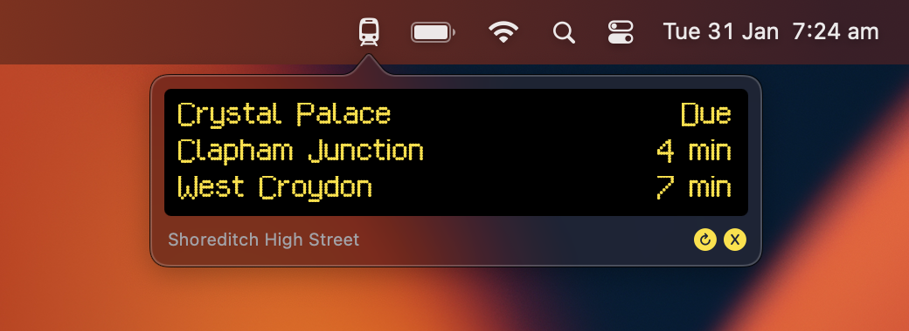

# TFL Arrivals

See your local train station arrivals board in your status bar! It's currently a MacOS app, but the API layer is built with Kotlin Multiplatform for the flexibility to add more UI targets later.

## Attribution

* Uses this incredible dot matrix display font: [London Underground Typeface](https://github.com/petykowski/London-Underground-Dot-Matrix-Typeface)
* Powered by TfL Open Data
  * OS data © Crown copyright and database rights 2016
  * Geomni UK Map data © and database rights 2019

## Local builds
You'll need to add a valid [Transport for London API](https://api-portal.tfl.gov.uk) app key, then configure the line, station, and platform in `Arrivals.kt`.
